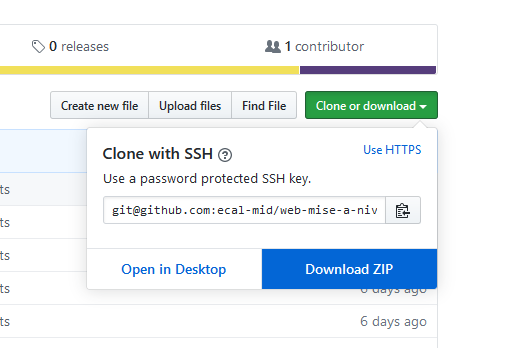

Installation
=================

Pour télécharger ce dossier cliquez sur "Download ZIP" comme illustré ci-dessous:



Structure des exemples
=================

Tous les exemples suivent une même structure.

Un fichier "index.html" se trouve à la racine de chaque dossier. Les styles et scripts sont stoqués soit dans un dossier "styles" soit dans un dossier "scripts".

```
exemple/
├── index.html
├── styles/
│   ├── style.css
├── scripts/
│   ├── sctipt.js
│   └── p5.min.js
└── images/
    └── img.jpg
```

Chaque fichier est commenté, il est donc conseillé de lire atentivement le code et les commentaires pour comprendre le fonctionnement de l'exemple.

(En développement)
Introduction
=================

Le World Wide Web, communément appelé le Web, à été développé dans les années 90 au CERN par Tim Berners Lee. Ce n’est qu’une des applications d’Internet, distincte d’autres applications comme le courrier électronique, la messagerie instantanée et le partage de fichiers en pair à pair.<br>
Se basant sur un système hypertexte, cette technologie permet de lier plusieurs contenus et articles present sur le "Web" par le biais d'hyperliens.<br>

Le World Wide Web se base principalement sur deux éléments:

1. Un server web est ordinateur sur le quel est installé un logiciel (server HTTP) qui sert des resources (images, videos, pages HTML, etc...) à un client. Son contenu est accessible via sont addresse IP (ex: 192.196.1.1) ou son nom de domaine (ex: ecal.ch).<br>
Le nom de domaine d'un server est une façon de simplifier son acces du fait qu'il est lisible par un humain. Ce nom de dommain est lié à l'adresse IP specifique du server via un server DNS. Un server DNS s'occupe donc de rediriger les requetes.

2. Un client HTTP est par exemple un navigateur (Firefox, Safari, Chrome, etc...) qui va faire des requetes à un server web et afficher la reponse de façon à ce qu'un humain puisse la comprendre (sous forme de page web).<br>
Les communications faites entre un client et un server sont faites via le protocole HTTP (HyperText Transfer Protocole).

Chaque page web est constituée de plusieurs éléments.

Un fichier HTML (Hyper Text Markup Language) est utilisé pour créer le "squelette" de la page. C'est avec ce language que le contenu est ajouté. Grace à ce language, il est possible d'ajouter un titre, du texte, des images, des videos, etc... à une page web.

Le CSS (Cascading Style Sheet) sert à modifier la mise en page. C'est avec ce language que l'on peut modifier la couleur, la taille, la position, etc... des éléments présents dans une page.

Le JS (JavaScript) est un language de programmation à part entière qui nous permet d'ajouter des comportement dynamiques à une page web.

Un site n'est rine d'autre que l'ensemble de pages web.

Quand un client fait une requete à un server (ex: ecal.ch) le server renvoie une page HTML qui est interpretée par la suite par le client.

Cette technologie devait initialement servir aux scientifiques pour partager du contenu et des articles scientifiques.

Ce dossier a été crée dans le cadre de la semaine de mise à niveau en Media & Interaction Design à l'ECAL.

Il contient 5 exemples (contenus dans des dossiers séparés) illustrent différentes technologies utilisée dans ce dommain.

Trois languages sont utilisés dans le développement d'un site web.

## 01 – Exemple DOM

---

Le DOM (Document Object Model) 

Cet exemple présente différentes balises HTML.

```html
<h1>Heading 1</h1>
<h2>Heading 2</h2>
<h3>Heading 3</h3>
<h4>Heading 4</h4>
<h5>Heading 5</h5>

<p>Ceci est un paragraphe</p>

<a href="ecal.ch">Ceci est un lien</a>

<!-- Ceci est un commentaire -->
<!-- Le navigateur ne prend donc pas en compte ce qui est écrit ici -->

<!-- Ceci est une image -->


<!-- Ceci est une liste (unordered list) -->
<ul>
  <li>Element 1</li>
  <li>Element 2</li>
  <li>Element 3</li>
  <li>Element 4</li>
</ul>

<!-- Ceci est une liste (ordered list) -->
<ol>
  <li>Element 1</li>
  <li>Element 2</li>
  <li>Element 3</li>
  <li>Element 4</li>
</ol>

<!-- Ceci est une division. Elle peut servir pour grouper plusieurs balises HTML -->
<div></div>
```

Ces balises sont détaillées dans le fichier `01_exemple-dom/index.html`

## 02 – Exemple CSS

---

## 03 – Exemple JS

---

## 04 – Exemple Canvas

---

## 05 – Exemple P5

---
